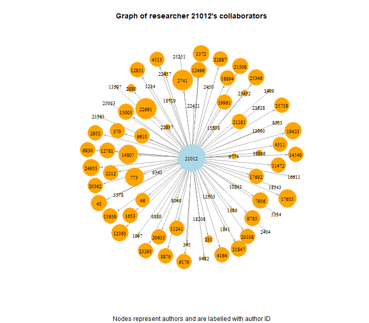
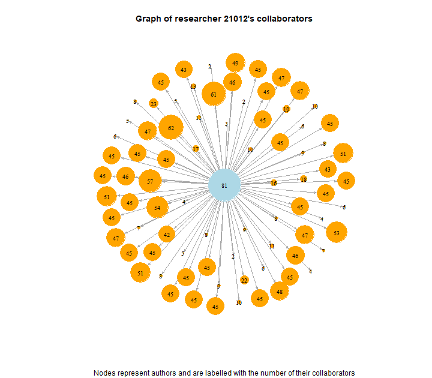

## Graph Visualisation

The Arxiv GR-QC dataset lists pairings of collaborators in papers submitted to Arxiv’s General Relativity and Quantum Cosmology category. It covers the 124 months between January 1993 and April 2003. The data contained two columns- “FromNodeId” and “ToNodeId”. Most edges were described twice - for example there was an edge from node “45” to node “21012” as well as from node “21012” to node “45”.

The researcher who collaborated the most was of interest and  had the node with the highest degree. This was node “21012” which had a total of 162 edges, 81 incoming and 81 outgoing. The visualization below shows the nodes directly connected node “21012” via outgoing edges. Individual outgoing edges from the neighboring nodes are not shown but instead the number of outgoing edges of all the nodes is represented by node size. The left graph is labelled with the node name and the right graph is labelled with the number of outgoing edges.

The researcher represented by node “21012” collaborated with a range of authors. Collaborators included other authors who were both big collaborators themselves (such as node “22691” with 62 collaborations and node “2741” with 61 collaborations) and small collaborators (such as nodes “18208”, “2450” and “25251” each with 2 collaborators).

This project was completed as part of a Data and Visual Analytics assignment at Georgia Institute of Technology.

Left photo                 |  Right photo
:-------------------------:|:-------------------------:
 |  

### Data set 
http://snap.stanford.edu/data/ca-GrQc.html

### References
http://kateto.net/network-visualization
https://stackoverflow.com/questions/49809744/how-to-subset-a-large-igraph-to-just-one-node-and-its-connected-nodes-using-r
